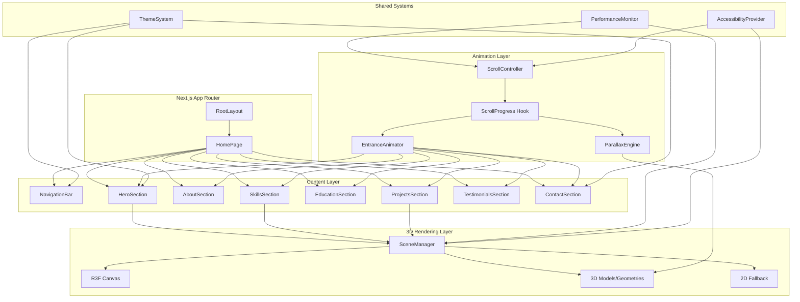

# Design Document

## Overview

This design describes a 3D parallax scroll-animated portfolio website for Umer Saiyad built with Next.js 16, React Three Fiber, Tailwind CSS 4, and TypeScript. The site features a dark futuristic theme, scroll-driven parallax animations across multiple depth layers, and graceful degradation for devices without WebGL support or with reduced-motion preferences.

The architecture separates concerns into three layers:
1. **3D Rendering Layer** — React Three Fiber canvas, scene management, and GPU resource lifecycle
2. **Animation Layer** — Scroll tracking, parallax calculations, and entrance animation orchestration
3. **Content Layer** — Section components, navigation, form handling, and responsive layout

This separation allows the content to remain accessible and functional even when 3D features are disabled or unavailable.

## Architecture



### Key Architectural Decisions

1. **Single shared R3F Canvas vs per-section canvases**: A single `<Canvas>` wrapping the page with `ScrollControls` from `@react-three/drei` avoids multiple WebGL contexts (browsers limit these). 3D elements are positioned in world space relative to scroll progress.

2. **Client Components for 3D, Server Components for static content**: Section text content and metadata use React Server Components for fast initial render. 3D scenes and interactive elements are client components loaded dynamically with `next/dynamic` and `ssr: false`.

3. **Progressive enhancement**: The site renders all content as semantic HTML first. 3D visuals are layered on top via absolute-positioned canvas. If WebGL fails, the content layer remains fully functional.

4. **Scroll-driven animation via Intersection Observer + requestAnimationFrame**: Rather than listening to every scroll event, we use IntersectionObserver for entrance triggers and a throttled scroll listener for parallax calculations, keeping the main thread responsive.

5. **Performance-adaptive rendering**: A `PerformanceMonitor` component tracks frame rate and dynamically reduces scene complexity (particle counts, shadow quality, post-processing) when performance drops below thresholds.

## Components and Interfaces

### SceneManager

```typescript
// components/3d/SceneManager.tsx
"use client";

interface SceneManagerProps {
  children: React.ReactNode;
  fallback?: React.ReactNode;
}

// Wraps R3F Canvas with WebGL detection, context loss handling,
// visibility-based pause/resume, and performance monitoring.
```

**Responsibilities:**
- Initialize WebGL context via React Three Fiber `<Canvas>`
- Detect WebGL support and render 2D fallback if unavailable
- Pause rendering when tab is inactive (Page Visibility API)
- Handle WebGL context loss/restoration
- Dispose GPU resources on unmount

### ScrollController

```typescript
// hooks/useScrollProgress.ts
"use client";

interface ScrollProgress {
  global: number;        // 0-1 overall page progress
  section: number;       // 0-1 progress within current section
  velocity: number;      // scroll speed for momentum effects
  direction: "up" | "down";
}

function useScrollProgress(sectionRef: RefObject<HTMLElement>): ScrollProgress;
```

```typescript
// hooks/useParallax.ts
interface ParallaxConfig {
  depth: "foreground" | "midground" | "background";
  axis?: "y" | "x" | "both";
  range?: [number, number]; // output range mapping
}

function useParallax(progress: number, config: ParallaxConfig): { x: number; y: number; z: number };
```

**Depth layer speeds:**
- Foreground: 1.0x scroll speed
- Midground: 0.5x scroll speed
- Background: 0.25x scroll speed

### EntranceAnimator

```typescript
// hooks/useEntranceAnimation.ts
"use client";

interface EntranceConfig {
  threshold?: number;     // viewport intersection ratio (default: 0.2)
  duration?: number;      // ms (default: 800)
  delay?: number;         // ms stagger delay
  easing?: string;        // CSS easing function
  reducedMotion?: boolean;
}

interface EntranceState {
  isVisible: boolean;
  hasAnimated: boolean;
  style: CSSProperties;   // transform + opacity for entrance
}

function useEntranceAnimation(ref: RefObject<HTMLElement>, config?: EntranceConfig): EntranceState;
```

### NavigationBar

```typescript
// components/NavigationBar.tsx
"use client";

interface NavLink {
  id: string;
  label: string;
  href: string;
}

interface NavigationBarProps {
  links: NavLink[];
}

// Fixed-position nav with active section highlighting,
// mobile hamburger menu, keyboard navigation, and smooth scroll.
```

### Section Components

Each section follows a consistent pattern:

```typescript
// components/sections/HeroSection.tsx
"use client";

interface HeroSectionProps {
  name: string;
  title: string;
  ctaTarget: string;
}

// components/sections/ProjectsSection.tsx
interface Project {
  id: string;
  title: string;
  shortDescription: string;  // max 120 chars
  fullDescription: string;
  techStack: string[];        // 2-6 tags
  externalUrl: string;
  thumbnail?: string;
}

interface ProjectsSectionProps {
  projects: Project[];
}
```

### ContactForm

```typescript
// components/ContactForm.tsx
"use client";

interface ContactFormData {
  name: string;       // max 100 chars
  email: string;      // max 254 chars, valid email format
  message: string;    // max 1000 chars
}

interface ValidationError {
  field: keyof ContactFormData;
  message: string;
}

function validateContactForm(data: ContactFormData): ValidationError[];
```

### PerformanceMonitor

```typescript
// hooks/usePerformanceMonitor.ts
"use client";

interface PerformanceState {
  fps: number;
  tier: "high" | "medium" | "low";
  shouldReduceComplexity: boolean;
}

function usePerformanceMonitor(): PerformanceState;
```

**Tier thresholds:**
- High: ≥30 FPS, full 3D rendering
- Medium: 20-30 FPS, reduce particle counts by 50%
- Low: <20 FPS, disable background parallax layer, simplify geometries

### AccessibilityProvider

```typescript
// providers/AccessibilityProvider.tsx
"use client";

interface AccessibilityContext {
  prefersReducedMotion: boolean;
  isWebGLSupported: boolean;
  deviceTier: "desktop" | "tablet" | "mobile";
}
```

## Data Models

### Site Content Data

```typescript
// data/portfolio.ts

interface PortfolioData {
  personal: {
    name: string;
    title: string;
    summary: string;
  };
  skills: SkillCategory[];
  education: EducationEntry[];
  projects: Project[];
  testimonials: Testimonial[];
  socialLinks: SocialLink[];
}

interface SkillCategory {
  name: string;
  skills: Skill[];
}

interface Skill {
  name: string;
  icon?: string;
}

interface EducationEntry {
  degree: string;
  university: string;
  field: string;
  duration: string;
}

interface Project {
  id: string;
  title: string;
  shortDescription: string;
  fullDescription: string;
  techStack: string[];
  externalUrl: string;
  thumbnail?: string;
}

interface Testimonial {
  id: string;
  name: string;
  role: string;
  quote: string;
}

interface SocialLink {
  platform: "github" | "linkedin" | "email";
  url: string;
  label: string;
}
```

### Animation State

```typescript
// types/animation.ts

interface AnimationState {
  scrollProgress: number;
  sectionProgress: Map<string, number>;
  activeSection: string;
  performanceTier: "high" | "medium" | "low";
}

interface ParallaxLayer {
  id: string;
  depth: "foreground" | "midground" | "background";
  speedMultiplier: number;
  currentOffset: { x: number; y: number; z: number };
}
```

### Theme Tokens

```typescript
// theme/tokens.ts

interface ThemeTokens {
  colors: {
    background: {
      primary: string;    // #0A0A0F
      secondary: string;  // #12121A
      tertiary: string;   // #1A1A2E
    };
    foreground: {
      primary: string;    // #FFFFFF
      secondary: string;  // #A0A0B0
      muted: string;      // #6B6B80
    };
    accent: {
      cyan: string;       // #00F5FF
      purple: string;     // #8B5CF6
      blue: string;       // #3B82F6
    };
    glow: {
      cyan: string;       // rgba(0, 245, 255, 0.4)
      purple: string;     // rgba(139, 92, 246, 0.4)
    };
  };
  glassmorphism: {
    blur: string;         // 12px
    opacity: number;      // 0.15
    border: string;       // 1px solid rgba(255, 255, 255, 0.1)
  };
  typography: {
    fontFamily: {
      sans: string;
      mono: string;
    };
    fontSize: {
      base: string;       // 16px
      lg: string;         // 18px
      xl: string;         // 20px
      "2xl": string;      // 24px
      "3xl": string;      // 30px
      "4xl": string;      // 36px
      "5xl": string;      // 48px
    };
  };
  spacing: {
    section: string;      // 6rem
    container: string;    // max-w-7xl
  };
  animation: {
    entrance: string;     // 800ms
    hover: string;        // 100ms
    transition: string;   // 300ms
  };
}
```

## Correctness Properties

*A property is a characteristic or behavior that should hold true across all valid executions of a system — essentially, a formal statement about what the system should do. Properties serve as the bridge between human-readable specifications and machine-verifiable correctness guarantees.*

### Property 1: Scroll progress is always normalized

*For any* section position, section height, viewport height, and scroll offset, the calculated scroll progress value SHALL always be a number between 0 and 1 (inclusive), and SHALL monotonically increase as the scroll offset moves from above the section to below it.

**Validates: Requirements 2.1**

### Property 2: Parallax depth layers maintain speed ratios

*For any* scroll progress value between 0 and 1, the parallax offset for the foreground layer SHALL equal exactly 2× the midground offset and 4× the background offset, preserving the 1.0x / 0.5x / 0.25x speed relationship.

**Validates: Requirements 2.2**

### Property 3: Stagger delay respects timing constraints

*For any* number of skill items N (where N ≥ 1), the calculated stagger delay per item SHALL be between 100ms and 200ms, and the total animation duration (delay × N) SHALL not exceed 1000ms.

**Validates: Requirements 6.2**

### Property 4: Project card enforces display constraints

*For any* project with an arbitrary-length description and arbitrary number of tech stack tags, the rendered card's displayed description SHALL be truncated to at most 120 characters, and the displayed tag count SHALL be clamped between 2 and 6.

**Validates: Requirements 8.5**

### Property 5: Testimonial carousel enforces count bounds

*For any* array of testimonials provided to the carousel component, the number of testimonials actually rendered SHALL be at least 2 and at most 10.

**Validates: Requirements 9.5**

### Property 6: Contact form validation correctness

*For any* combination of name, email, and message inputs, the validation function SHALL return errors for exactly the fields that violate constraints (empty required fields, email not matching RFC 5322 format, name exceeding 100 characters, email exceeding 254 characters, or message exceeding 1000 characters), and SHALL return an empty error array when all fields are valid.

**Validates: Requirements 10.1, 10.2**

### Property 7: Active section detection

*For any* set of section positions and a scroll offset, exactly one section SHALL be identified as active, and it SHALL be the section whose top boundary is closest to (but not below) the current viewport top plus navigation bar height.

**Validates: Requirements 11.3**

### Property 8: Device tier classification from viewport width

*For any* viewport width value, the device tier SHALL be classified as "desktop" when width ≥ 1024px, "tablet" when 768px ≤ width < 1024px, and "mobile" when width < 768px, with no gaps or overlaps in the classification ranges.

**Validates: Requirements 12.1**

### Property 9: Reduced motion disables all parallax offsets

*For any* scroll position and any parallax layer configuration, when the user has `prefers-reduced-motion: reduce` enabled, all computed parallax offsets SHALL be zero and all elements SHALL be positioned at their final animation state.

**Validates: Requirements 13.2**

### Property 10: Theme color contrast meets WCAG thresholds

*For any* text/background color pair defined in the theme token system, the computed contrast ratio SHALL be at least 4.5:1 for normal-size text (below 18px regular or 14px bold) and at least 3:1 for large text (18px regular or 14px bold and above).

**Validates: Requirements 13.3**

## Error Handling

### WebGL Failures

| Scenario | Handling |
|----------|----------|
| WebGL not supported | Detect via `document.createElement('canvas').getContext('webgl')` before mounting Canvas. Render 2D fallback layout. |
| WebGL context lost | Listen for `webglcontextlost` event. Attempt restoration for 5 seconds. If failed, switch to 2D fallback preserving scroll position. |
| 3D model load failure | Show skeleton placeholder during load. After 10s timeout, display static fallback image. |
| GPU resource exhaustion | PerformanceMonitor detects FPS drop → reduce complexity tier. Dispose unused resources aggressively. |

### Form Submission Errors

| Scenario | Handling |
|----------|----------|
| Client validation failure | Display inline error messages adjacent to invalid fields. No network request made. Preserve all entered data. |
| Network timeout (>10s) | Display error toast/message. Preserve form data. Allow retry. |
| Server error (5xx) | Display generic error message. Preserve form data. Suggest retry or alternative contact method. |
| Rate limiting (429) | Display "please try again later" message. Preserve form data. |

### Performance Degradation

| Scenario | Handling |
|----------|----------|
| FPS < 20 | Disable background parallax layer. Reduce particle counts. |
| FPS < 15 | Switch to 2D fallback for current section. |
| Asset load timeout | Replace with static placeholder. Log to console for debugging. |
| Memory pressure | Dispose off-screen 3D resources. Reduce texture resolution. |

### Accessibility Fallbacks

| Scenario | Handling |
|----------|----------|
| `prefers-reduced-motion: reduce` | All animations disabled. Content shown in final state. Parallax offsets = 0. |
| Screen reader detected | 3D elements marked `aria-hidden="true"`. Descriptive text alternatives provided. |
| Keyboard-only navigation | All interactive elements focusable. Skip link available. Focus indicators visible. |

## Testing Strategy

### Unit Tests (Example-Based)

Unit tests cover specific scenarios, edge cases, and component rendering:

- **SceneManager**: WebGL detection, context loss handling, visibility pause/resume
- **NavigationBar**: Rendering all links, hamburger menu toggle, keyboard navigation
- **ContactForm**: Label associations, aria-describedby on errors, field rendering
- **Section components**: Content rendering, required data display
- **Theme tokens**: All required categories defined, color values within constraints
- **Accessibility**: Skip link presence, aria attributes, focus indicators

### Property-Based Tests

Property tests verify universal correctness properties using `fast-check` (TypeScript PBT library):

- **Minimum 100 iterations** per property test
- Each test tagged with: `Feature: 3d-portfolio-site, Property {N}: {title}`
- Tests target pure logic functions extracted from components

| Property | Function Under Test | Generator Strategy |
|----------|--------------------|--------------------|
| 1: Scroll progress normalized | `calculateScrollProgress(sectionTop, sectionHeight, viewportHeight, scrollOffset)` | Random positive integers for all params |
| 2: Parallax depth ratios | `calculateParallaxOffset(progress, depth)` | Random floats [0,1] for progress, enum for depth |
| 3: Stagger delay constraints | `calculateStaggerDelay(itemCount, maxDuration)` | Random integers [1, 50] for count |
| 4: Project card constraints | `formatProjectCard(project)` | Random strings of varying length, random arrays |
| 5: Testimonial count bounds | `clampTestimonialCount(testimonials)` | Random arrays of length [0, 20] |
| 6: Form validation | `validateContactForm(data)` | Random strings with varying lengths, formats |
| 7: Active section detection | `getActiveSection(sections, scrollOffset, navHeight)` | Random section arrays and scroll offsets |
| 8: Device tier classification | `getDeviceTier(viewportWidth)` | Random positive integers [0, 4000] |
| 9: Reduced motion parallax | `calculateParallaxOffset(progress, depth, reducedMotion)` | Random progress with reducedMotion=true |
| 10: Color contrast | `getContrastRatio(foreground, background)` against theme pairs | All theme color pairs |

### Integration Tests

- Lighthouse CI for performance (≥70 desktop, ≥60 mobile) and accessibility (≥90) scores
- Full page render test verifying all sections mount without errors
- Scroll simulation verifying entrance animations trigger
- Form submission with mocked API endpoint
- Responsive layout verification at desktop/tablet/mobile breakpoints

### Testing Libraries

- **Unit/Integration**: Vitest + React Testing Library
- **Property-Based**: fast-check (with Vitest)
- **E2E** (optional): Playwright for scroll behavior and visual regression
- **Performance**: Lighthouse CI in GitHub Actions

